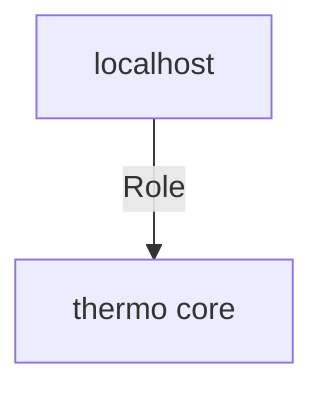

<!-- DOCSIBLE START -->

# 📃 Role overview

## thermo-core


Description: your role description


| Field                | Value           |
|--------------------- |-----------------|
| Readme update        | 29/10/2024 |


### Defaults

**These are static variables with lower priority**

#### File: defaults/main.yml

| Var          | Type         | Value       |Required    | Title       |
|--------------|--------------|-------------|-------------|-------------|
| [min_temperature_threshold](defaults/main.yml#L7)   | int   | `3000`  |  True  |  Minimum temperature required for energy generation (in °K) |
| [optimal_pressure_threshold](defaults/main.yml#L12)   | int   | `4500`  |  True  |  Target pressure for optimal energy generation (in Pa) |
| [max_cooldown_rate](defaults/main.yml#L17)   | int   | `50`  |  True  |  Maximum cooldown rate allowable (°C/min) |
| [coolant_level_threshold](defaults/main.yml#L25)   | int   | `30`  |  True  |  Default coolant level threshold (percentage) |
| [pressure_safety_margin](defaults/main.yml#L30)   | int   | `200`  |  True  |  Safety margin for containment pressure (in Pa) |
| [max_energy_storage](defaults/main.yml#L35)   | int   | `500`  |  False  |  Optimal energy storage capacity (in MW) |
| [external_temp_check_interval](defaults/main.yml#L40)   | int   | `60`  |  False  |  External temperature check frequency (in seconds) |
| [max_energy_output](defaults/main.yml#L45)   | int   | `450`  |  True  |  Maximum energy output for safe operation (in MW) |
| [simulation_duration](defaults/main.yml#L53)   | int   | `300`  |  False  |  High-energy simulation duration (in seconds) |
| [operation_modes](defaults/main.yml#L56)   | list   | `['Standard', 'High-Energy', 'Emergency Cooldown', 'Maintenance']`  |  n/a  |  n/a |
| [coolant_types](defaults/main.yml#L62)   | list   | `['Water-based', 'Gel-based', 'Synthetic']`  |  n/a  |  n/a |
<details>
<summary><b>🖇️ Full descriptions for vars in defaults/main.yml</b></summary>
<br>
<b>min_temperature_threshold:</b> The minimum core temperature required to initiate the energy synthesis process.
<br>
<b>optimal_pressure_threshold:</b> Optimal pressure setting for ThermoCore to maximize energy output under safe conditions.
<br>
<b>max_cooldown_rate:</b> The rate at which ThermoCore can cool down without causing structural strain.
<br>
<b>coolant_level_threshold:</b> This variable sets the minimum allowable coolant level for ThermoCore to function.<br>
If coolant levels fall below this threshold, ThermoCore will initiate emergency coolant refill protocols.<br>
This prevents overheating and maintains safe operational conditions.<br>
<br>
<b>pressure_safety_margin:</b> Buffer pressure level in containment to maintain system stability in fluctuating environments.
<br>
<b>max_energy_storage:</b> Maximum energy storage capacity of ThermoCore in megawatts. Exceeding this may result in overflow.
<br>
<b>external_temp_check_interval:</b> Frequency at which external temperature is checked to adjust ThermoCore energy generation.
<br>
<b>max_energy_output:</b> Sets the cap for energy output to avoid overloading ThermoCore or connected storage systems.
<br>
<b>simulation_duration:</b> Specifies the duration ThermoCore operates under high-energy conditions.<br>
Shorter durations are safer but generate less energy.<br>
Longer durations may increase energy generation but risk overheating.<br>
<br>
<br>
</details>


### Tasks


#### File: tasks/main.yml

| Name | Module | Has Conditions | Comments |
| ---- | ------ | --------- |  -------- |
| Start ThermoCore diagnostics | ansible.builtin.debug | False | tasks file for thermo-core Initialize system and environment |
| Check ambient environmental conditions | block | False |  |
| Fetch ambient temperature and pressure | ansible.builtin.set_fact | False |  |
| Verify ambient conditions for high-energy simulation | ansible.builtin.debug | True |  |
| Configure ThermoCore for high-energy conditions | block | False | Initialize high-temperature and high-pressure simulation |
| Set high temperature and pressure thresholds | ansible.builtin.set_fact | False |  |
| Activate high-energy synthesis mode | ansible.builtin.debug | False |  |
| Begin energy generation cycle | block | False | Simulate energy generation cycle |
| Initialize energy storage capacitors | ansible.builtin.debug | False |  |
| Simulate energy output based on temperature and pressure | ansible.builtin.set_fact | True |  |
| Confirm energy generation success | ansible.builtin.debug | False |  |
| Monitor for heat dissipation and coolant levels | block | False | Environmental monitoring and resource checks |
| Measure coolant levels | ansible.builtin.set_fact | False |  |
| Check if coolant levels are sufficient | ansible.builtin.debug | True |  |
| Alert if coolant is low | ansible.builtin.debug | True |  |
| Verify pressure containment integrity | block | False | Safety checks for pressure containment |
| Check pressure containment status | ansible.builtin.set_fact | False |  |
| Ensure containment for continued operation | ansible.builtin.debug | True |  |
| Adaptive energy generation based on environmental feedback | block | False | Adjust energy generation based on environmental input |
| Gather environmental feedback data | ansible.builtin.set_fact | False |  |
| Adjust ThermoCore thresholds based on environment | ansible.builtin.debug | False |  |
| Adaptive cycle based on operational data | block | False | Machine learning feedback for system optimization |
| Integrate operational data into learning model | ansible.builtin.debug | False |  |
| Adjust thresholds based on feedback loop | ansible.builtin.debug | True |  |
| Perform end-of-cycle diagnostics | block | False | Final cycle diagnostics |
| Check all system metrics post-energy generation | ansible.builtin.debug | False |  |
| Review energy efficiency metrics | ansible.builtin.debug | False |  |
| Begin ThermoCore shutdown | ansible.builtin.debug | False | Shutdown and cooling procedures |
| Run cooldown diagnostics | block | False |  |
| Monitor system cooldown rates | ansible.builtin.set_fact | False |  |
| Confirm cooldown success | ansible.builtin.debug | True |  |


## Task Flow Graphs


### Graph for main.yml

```mermaid
flowchart TD
Start
classDef block stroke:#3498db,stroke-width:2px;
classDef task stroke:#4b76bb,stroke-width:2px;
classDef include stroke:#2ecc71,stroke-width:2px;
classDef import stroke:#f39c12,stroke-width:2px;
classDef rescue stroke:#665352,stroke-width:2px;
classDef importPlaybook stroke:#9b59b6,stroke-width:2px;
classDef importTasks stroke:#34495e,stroke-width:2px;
classDef includeTasks stroke:#16a085,stroke-width:2px;
classDef importRole stroke:#699ba7,stroke-width:2px;
classDef includeRole stroke:#2980b9,stroke-width:2px;
classDef includeVars stroke:#8e44ad,stroke-width:2px;

  Start-->|Task| Start_ThermoCore_diagnostics0[start thermocore diagnostics]:::task
  Start_ThermoCore_diagnostics0-->|Block Start| Check_ambient_environmental_conditions1_block_start_0[[check ambient environmental conditions]]:::block
  Check_ambient_environmental_conditions1_block_start_0-->|Task| Fetch_ambient_temperature_and_pressure0[fetch ambient temperature and pressure]:::task
  Fetch_ambient_temperature_and_pressure0-->|Task| Verify_ambient_conditions_for_high_energy_simulation1_when__ambient_temperature___int___45__and__ambient_pressure___int___1000_[verify ambient conditions for high energy<br>simulation]:::task
  Verify_ambient_conditions_for_high_energy_simulation1_when__ambient_temperature___int___45__and__ambient_pressure___int___1000_---|When:  ambient temperature   int   45  and  ambient<br>pressure   int   1000 | Verify_ambient_conditions_for_high_energy_simulation1_when__ambient_temperature___int___45__and__ambient_pressure___int___1000_
  Verify_ambient_conditions_for_high_energy_simulation1_when__ambient_temperature___int___45__and__ambient_pressure___int___1000_-.->|End of Block| Check_ambient_environmental_conditions1_block_start_0
  Verify_ambient_conditions_for_high_energy_simulation1_when__ambient_temperature___int___45__and__ambient_pressure___int___1000_-->|Rescue Start| Check_ambient_environmental_conditions1_rescue_start_0[check ambient environmental conditions]:::rescue
  Check_ambient_environmental_conditions1_rescue_start_0-->|Task| Handle_unfavorable_ambient_conditions0[handle unfavorable ambient conditions]:::task
  Handle_unfavorable_ambient_conditions0-.->|End of Rescue Block| Check_ambient_environmental_conditions1_block_start_0
  Handle_unfavorable_ambient_conditions0-->|Block Start| Configure_ThermoCore_for_high_energy_conditions2_block_start_0[[configure thermocore for high energy conditions]]:::block
  Configure_ThermoCore_for_high_energy_conditions2_block_start_0-->|Task| Set_high_temperature_and_pressure_thresholds0[set high temperature and pressure thresholds]:::task
  Set_high_temperature_and_pressure_thresholds0-->|Task| Activate_high_energy_synthesis_mode1[activate high energy synthesis mode]:::task
  Activate_high_energy_synthesis_mode1-.->|End of Block| Configure_ThermoCore_for_high_energy_conditions2_block_start_0
  Activate_high_energy_synthesis_mode1-->|Rescue Start| Configure_ThermoCore_for_high_energy_conditions2_rescue_start_0[configure thermocore for high energy conditions]:::rescue
  Configure_ThermoCore_for_high_energy_conditions2_rescue_start_0-->|Task| Handle_ThermoCore_setup_failure0[handle thermocore setup failure]:::task
  Handle_ThermoCore_setup_failure0-.->|End of Rescue Block| Configure_ThermoCore_for_high_energy_conditions2_block_start_0
  Handle_ThermoCore_setup_failure0-->|Block Start| Begin_energy_generation_cycle3_block_start_0[[begin energy generation cycle]]:::block
  Begin_energy_generation_cycle3_block_start_0-->|Task| Initialize_energy_storage_capacitors0[initialize energy storage capacitors]:::task
  Initialize_energy_storage_capacitors0-->|Task| Simulate_energy_output_based_on_temperature_and_pressure1_when_target_temperature___int___min_temperature_threshold_and_target_pressure___int___optimal_pressure_threshold[simulate energy output based on temperature and<br>pressure]:::task
  Simulate_energy_output_based_on_temperature_and_pressure1_when_target_temperature___int___min_temperature_threshold_and_target_pressure___int___optimal_pressure_threshold---|When: target temperature   int   min temperature<br>threshold and target pressure   int   optimal<br>pressure threshold| Simulate_energy_output_based_on_temperature_and_pressure1_when_target_temperature___int___min_temperature_threshold_and_target_pressure___int___optimal_pressure_threshold
  Simulate_energy_output_based_on_temperature_and_pressure1_when_target_temperature___int___min_temperature_threshold_and_target_pressure___int___optimal_pressure_threshold-->|Task| Confirm_energy_generation_success2[confirm energy generation success]:::task
  Confirm_energy_generation_success2-.->|End of Block| Begin_energy_generation_cycle3_block_start_0
  Confirm_energy_generation_success2-->|Rescue Start| Begin_energy_generation_cycle3_rescue_start_0[begin energy generation cycle]:::rescue
  Begin_energy_generation_cycle3_rescue_start_0-->|Task| Handle_energy_generation_failure0[handle energy generation failure]:::task
  Handle_energy_generation_failure0-.->|End of Rescue Block| Begin_energy_generation_cycle3_block_start_0
  Handle_energy_generation_failure0-->|Block Start| Monitor_for_heat_dissipation_and_coolant_levels4_block_start_0[[monitor for heat dissipation and coolant levels]]:::block
  Monitor_for_heat_dissipation_and_coolant_levels4_block_start_0-->|Task| Measure_coolant_levels0[measure coolant levels]:::task
  Measure_coolant_levels0-->|Task| Check_if_coolant_levels_are_sufficient1_when_coolant_level___int____coolant_level_threshold[check if coolant levels are sufficient]:::task
  Check_if_coolant_levels_are_sufficient1_when_coolant_level___int____coolant_level_threshold---|When: coolant level   int    coolant level threshold| Check_if_coolant_levels_are_sufficient1_when_coolant_level___int____coolant_level_threshold
  Check_if_coolant_levels_are_sufficient1_when_coolant_level___int____coolant_level_threshold-->|Task| Alert_if_coolant_is_low2_when_coolant_level___int___coolant_level_threshold[alert if coolant is low]:::task
  Alert_if_coolant_is_low2_when_coolant_level___int___coolant_level_threshold---|When: coolant level   int   coolant level threshold| Alert_if_coolant_is_low2_when_coolant_level___int___coolant_level_threshold
  Alert_if_coolant_is_low2_when_coolant_level___int___coolant_level_threshold-.->|End of Block| Monitor_for_heat_dissipation_and_coolant_levels4_block_start_0
  Alert_if_coolant_is_low2_when_coolant_level___int___coolant_level_threshold-->|Rescue Start| Monitor_for_heat_dissipation_and_coolant_levels4_rescue_start_0[monitor for heat dissipation and coolant levels]:::rescue
  Monitor_for_heat_dissipation_and_coolant_levels4_rescue_start_0-->|Task| Activate_emergency_coolant_system0[activate emergency coolant system]:::task
  Activate_emergency_coolant_system0-.->|End of Rescue Block| Monitor_for_heat_dissipation_and_coolant_levels4_block_start_0
  Activate_emergency_coolant_system0-->|Block Start| Verify_pressure_containment_integrity5_block_start_0[[verify pressure containment integrity]]:::block
  Verify_pressure_containment_integrity5_block_start_0-->|Task| Check_pressure_containment_status0[check pressure containment status]:::task
  Check_pressure_containment_status0-->|Task| Ensure_containment_for_continued_operation1_when_containment_integrity_____intact_[ensure containment for continued operation]:::task
  Ensure_containment_for_continued_operation1_when_containment_integrity_____intact_---|When: containment integrity     intact | Ensure_containment_for_continued_operation1_when_containment_integrity_____intact_
  Ensure_containment_for_continued_operation1_when_containment_integrity_____intact_-.->|End of Block| Verify_pressure_containment_integrity5_block_start_0
  Ensure_containment_for_continued_operation1_when_containment_integrity_____intact_-->|Rescue Start| Verify_pressure_containment_integrity5_rescue_start_0[verify pressure containment integrity]:::rescue
  Verify_pressure_containment_integrity5_rescue_start_0-->|Task| Engage_containment_failure_protocols0[engage containment failure protocols]:::task
  Engage_containment_failure_protocols0-.->|End of Rescue Block| Verify_pressure_containment_integrity5_block_start_0
  Engage_containment_failure_protocols0-->|Block Start| Adaptive_energy_generation_based_on_environmental_feedback6_block_start_0[[adaptive energy generation based on environmental<br>feedback]]:::block
  Adaptive_energy_generation_based_on_environmental_feedback6_block_start_0-->|Task| Gather_environmental_feedback_data0[gather environmental feedback data]:::task
  Gather_environmental_feedback_data0-->|Task| Adjust_ThermoCore_thresholds_based_on_environment1[adjust thermocore thresholds based on environment]:::task
  Adjust_ThermoCore_thresholds_based_on_environment1-.->|End of Block| Adaptive_energy_generation_based_on_environmental_feedback6_block_start_0
  Adjust_ThermoCore_thresholds_based_on_environment1-->|Rescue Start| Adaptive_energy_generation_based_on_environmental_feedback6_rescue_start_0[adaptive energy generation based on environmental<br>feedback]:::rescue
  Adaptive_energy_generation_based_on_environmental_feedback6_rescue_start_0-->|Task| Handle_external_data_retrieval_failure0[handle external data retrieval failure]:::task
  Handle_external_data_retrieval_failure0-.->|End of Rescue Block| Adaptive_energy_generation_based_on_environmental_feedback6_block_start_0
  Handle_external_data_retrieval_failure0-->|Block Start| Adaptive_cycle_based_on_operational_data7_block_start_0[[adaptive cycle based on operational data]]:::block
  Adaptive_cycle_based_on_operational_data7_block_start_0-->|Task| Integrate_operational_data_into_learning_model0[integrate operational data into learning model]:::task
  Integrate_operational_data_into_learning_model0-->|Task| Adjust_thresholds_based_on_feedback_loop1_when_learning_model_ready___default_false_[adjust thresholds based on feedback loop]:::task
  Adjust_thresholds_based_on_feedback_loop1_when_learning_model_ready___default_false_---|When: learning model ready   default false | Adjust_thresholds_based_on_feedback_loop1_when_learning_model_ready___default_false_
  Adjust_thresholds_based_on_feedback_loop1_when_learning_model_ready___default_false_-.->|End of Block| Adaptive_cycle_based_on_operational_data7_block_start_0
  Adjust_thresholds_based_on_feedback_loop1_when_learning_model_ready___default_false_-->|Rescue Start| Adaptive_cycle_based_on_operational_data7_rescue_start_0[adaptive cycle based on operational data]:::rescue
  Adaptive_cycle_based_on_operational_data7_rescue_start_0-->|Task| Manage_learning_model_integration_failure0[manage learning model integration failure]:::task
  Manage_learning_model_integration_failure0-.->|End of Rescue Block| Adaptive_cycle_based_on_operational_data7_block_start_0
  Manage_learning_model_integration_failure0-->|Block Start| Perform_end_of_cycle_diagnostics8_block_start_0[[perform end of cycle diagnostics]]:::block
  Perform_end_of_cycle_diagnostics8_block_start_0-->|Task| Check_all_system_metrics_post_energy_generation0[check all system metrics post energy generation]:::task
  Check_all_system_metrics_post_energy_generation0-->|Task| Review_energy_efficiency_metrics1[review energy efficiency metrics]:::task
  Review_energy_efficiency_metrics1-.->|End of Block| Perform_end_of_cycle_diagnostics8_block_start_0
  Review_energy_efficiency_metrics1-->|Rescue Start| Perform_end_of_cycle_diagnostics8_rescue_start_0[perform end of cycle diagnostics]:::rescue
  Perform_end_of_cycle_diagnostics8_rescue_start_0-->|Task| Handle_diagnostics_failure0[handle diagnostics failure]:::task
  Handle_diagnostics_failure0-.->|End of Rescue Block| Perform_end_of_cycle_diagnostics8_block_start_0
  Handle_diagnostics_failure0-->|Task| Begin_ThermoCore_shutdown9[begin thermocore shutdown]:::task
  Begin_ThermoCore_shutdown9-->|Block Start| Run_cooldown_diagnostics10_block_start_0[[run cooldown diagnostics]]:::block
  Run_cooldown_diagnostics10_block_start_0-->|Task| Monitor_system_cooldown_rates0[monitor system cooldown rates]:::task
  Monitor_system_cooldown_rates0-->|Task| Confirm_cooldown_success1_when_cooldown_rate_____nominal_[confirm cooldown success]:::task
  Confirm_cooldown_success1_when_cooldown_rate_____nominal_---|When: cooldown rate     nominal | Confirm_cooldown_success1_when_cooldown_rate_____nominal_
  Confirm_cooldown_success1_when_cooldown_rate_____nominal_-.->|End of Block| Run_cooldown_diagnostics10_block_start_0
  Confirm_cooldown_success1_when_cooldown_rate_____nominal_-->|Rescue Start| Run_cooldown_diagnostics10_rescue_start_0[run cooldown diagnostics]:::rescue
  Run_cooldown_diagnostics10_rescue_start_0-->|Task| Emergency_cooldown_protocol0[emergency cooldown protocol]:::task
  Emergency_cooldown_protocol0-.->|End of Rescue Block| Run_cooldown_diagnostics10_block_start_0
  Emergency_cooldown_protocol0-->End
```




## Playbook

```yml
---
- hosts: localhost
  remote_user: root
  roles:
    - thermo-core

```
## Playbook graph


## Author Information
Lucian BLETAN

#### License

license (GPL-2.0-or-later, MIT, etc)

#### Minimum Ansible Version

2.1

#### Platforms

No platforms specified.
<!-- DOCSIBLE END -->