<!-- DOCSIBLE START -->

# 📃 Role overview

## test1

Description: your role description

| Field                | Value           |
|--------------------- |-----------------|
| Readme update        | 13/11/2024 |

### Defaults

**These are static variables with lower priority**

#### File: defaults/main.yml

| Var          | Type         | Value       |Required    | Title       |
|--------------|--------------|-------------|-------------|-------------|
| [nodejs_setup_install_method](defaults/main.yml#L7)   | str   | `package` |    n/a  |  n/a |
| [nodejs_setup_version](defaults/main.yml#L12)   | str   | `14.17.0` |    n/a  |  n/a |
| [nodejs_setup_dev_path](defaults/main.yml#L17)   | str   | `/usr/local/nodejs` |    n/a  |  n/a |
| [nodejs_setup_env_path](defaults/main.yml#L22)   | str   | `/opt/dev_nodejs` |    n/a  |  n/a |

<b>🖇️ Full descriptions for vars in defaults/main.yml</b>

 
<b>nodejs_setup_install_method:</b> Méthode d'installation de Node.js, soit "package" pour utiliser le gestionnaire de paquets, soit "source" pour télécharger les sources
 
<b>nodejs_setup_version:</b> Version par défaut de Node.js à installer si l'installation se fait depuis les sources
 
<b>nodejs_setup_dev_path:</b> Chemin d'installation pour Node.js si l'installation se fait depuis les sources
 
<b>nodejs_setup_env_path:</b> Chemin pour créer un dossier de développement Node.js
 
 

### Tasks

#### File: tasks/main.yml

| Name | Module | Has Conditions | Comments |
| ---- | ------ | --------- |  -------- |
| Installation de Node.js - choix de la méthode d'installation | block | False | tasks file for demo/roles/nodejs_setup |
| Installer Node.js avec le gestionnaire de paquets | ansible.builtin.yum | True |  |
| Installer les dépendances pour compiler Node.js à partir des sources | ansible.builtin.yum | True |  |
| Télécharger les sources de Node.js | ansible.builtin.get_url | True |  |
| Extraire les sources de Node.js | ansible.builtin.unarchive | True |  |
| Compiler et installer Node.js à partir des sources | ansible.builtin.command | True |  |
| Vérification de la disponibilité de Node.js | ansible.builtin.command | False |  |
| Créer un dossier pour l'environnement de développement | ansible.builtin.file | False |  |
| Vérifier si npm est installé | ansible.builtin.command | False |  |
| Installer npm si nécessaire | ansible.builtin.command | True |  |
| Vérification de l'installation de npm | ansible.builtin.command | False |  |

## Task Flow Graphs

### Graph for main.yml

```mermaid
flowchart TD
Start
classDef block stroke:#3498db,stroke-width:2px;
classDef task stroke:#4b76bb,stroke-width:2px;
classDef includeTasks stroke:#16a085,stroke-width:2px;
classDef importTasks stroke:#34495e,stroke-width:2px;
classDef includeRole stroke:#2980b9,stroke-width:2px;
classDef importRole stroke:#699ba7,stroke-width:2px;
classDef includeVars stroke:#8e44ad,stroke-width:2px;
classDef rescue stroke:#665352,stroke-width:2px;

  Start-->|Block Start| Installation_de_Node_js___choix_de_la_méthode_d_installation0_block_start_0[[installation de node js   choix de la méthode d<br>installation]]:::block
  Installation_de_Node_js___choix_de_la_méthode_d_installation0_block_start_0-->|Task| Installer_Node_js_avec_le_gestionnaire_de_paquets0[installer node js avec le gestionnaire de paquets<br>When: **nodejs setup install method     package**]:::task
  Installer_Node_js_avec_le_gestionnaire_de_paquets0-->|Task| Installer_les_dépendances_pour_compiler_Node_js_à_partir_des_sources1[installer les dépendances pour compiler node js à<br>partir des sources<br>When: **nodejs setup install method     source**]:::task
  Installer_les_dépendances_pour_compiler_Node_js_à_partir_des_sources1-->|Task| Télécharger_les_sources_de_Node_js2[télécharger les sources de node js<br>When: **nodejs setup install method     source**]:::task
  Télécharger_les_sources_de_Node_js2-->|Task| Extraire_les_sources_de_Node_js3[extraire les sources de node js<br>When: **nodejs setup install method     source**]:::task
  Extraire_les_sources_de_Node_js3-->|Task| Compiler_et_installer_Node_js_à_partir_des_sources4[compiler et installer node js à partir des sources<br>When: **nodejs setup install method     source**]:::task
  Compiler_et_installer_Node_js_à_partir_des_sources4-.->|End of Block| Installation_de_Node_js___choix_de_la_méthode_d_installation0_block_start_0
  Compiler_et_installer_Node_js_à_partir_des_sources4-->|Task| Vérification_de_la_disponibilité_de_Node_js1[vérification de la disponibilité de node js]:::task
  Vérification_de_la_disponibilité_de_Node_js1-->|Task| Créer_un_dossier_pour_l_environnement_de_développement2[créer un dossier pour l environnement de<br>développement]:::task
  Créer_un_dossier_pour_l_environnement_de_développement2-->|Task| Vérifier_si_npm_est_installé3[vérifier si npm est installé]:::task
  Vérifier_si_npm_est_installé3-->|Task| Installer_npm_si_nécessaire4[installer npm si nécessaire<br>When: **npm check rc    0**]:::task
  Installer_npm_si_nécessaire4-->|Task| Vérification_de_l_installation_de_npm5[vérification de l installation de npm]:::task
  Vérification_de_l_installation_de_npm5-->End
```

## Author Information
your name

#### License

license (GPL-2.0-or-later, MIT, etc)

#### Minimum Ansible Version

2.1

#### Platforms

No platforms specified.
<!-- DOCSIBLE END -->
